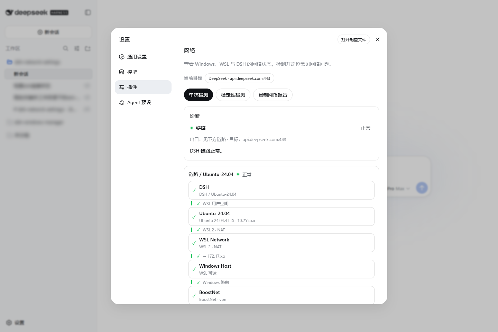
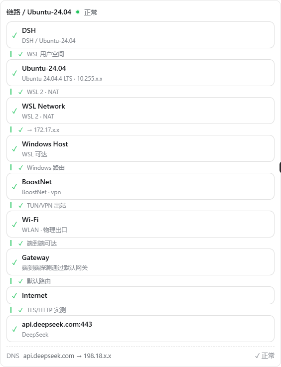
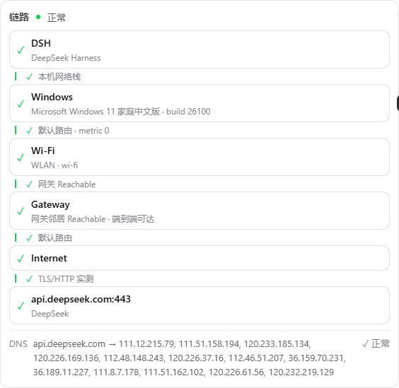

# dsh-network-settings

<p align="center">
  <a href="README.zh-CN.md">简体中文</a> | <a href="README.md">English</a>
</p>

DSH 网络设置：为 DeepSeek Harness 提供 Windows / WSL / macOS 网络链路诊断与安全修复。

## 特性

- 自动检测 **Windows 原生**、**WSL 发行版** 与 **macOS** 三种运行模型。
- 展示当前 **DSH 进程** 的真实网络路径、DNS 侧支和第一个失败点；TUN/VPN 虚拟网卡后面自动补出物理出口与真实网关。
- 识别 **配置漂移**：配置不同但网络正常时只提示，不警告。
- 支持 **单次检测** 与 **稳定性检测**，默认目标 DeepSeek、可随时切换；每层探测与整次检测都有超时上限，网络故障也不会长时间无响应。
- 一键复制 **适合 Agent 的 Markdown 网络报告**：固定英文小节标题与 `report-version`、TL;DR 摘要先行、机器可读的诊断码与分层探测延迟。
- **推荐修复** 只在高置信度诊断映射到常用低风险操作时出现（如清理代理残余环境变量、关闭系统代理、刷新 DNS 缓存）；管理员级与高风险操作仅保留在手动目录。
- 持久化修改遵循：**快照 → 预览 → 确认 → 应用 → 重新检测 → 可回滚**。
- UI 使用 DSH 原生组件与 `--dsw-*` token，不建立独立主题。

## 界面

<table>
<tr><td colspan="2" align="center">

插件位于 **DSH 设置 → 插件 → 网络**（点击图片可放大）

<a href="docs/images/wsl-in-dsh.png"></a>

</td></tr>
<tr>
<td width="50%" align="center">

<a href="docs/images/wsl-path-graph.png"></a>

<sub>WSL 发行版中的 DSH 链路：DSH → 发行版 → WSL NAT → Windows Host → 代理 TUN → 物理网卡 → 网关 → 目标</sub>

</td>
<td width="50%" align="center">

<a href="docs/images/win-path-graph.png"></a>

<sub>Windows 原生 DSH 链路：TUN/VPN 虚拟网卡后自动接出物理出口与真实网关</sub>

</td>
</tr>
<tr>
<td width="42%" align="center" valign="top">

<a href="docs/images/win-network-config.png"></a>

<sub>网络配置分组视图</sub>

</td>
<td width="58%" valign="top">

**网络配置**按来源分组，每个配置项可溯源：

- **Windows 代理**：WinINet / WinHTTP 状态、三个作用域的代理环境变量（含大小写）
- **DSH 进程环境**：运行时模型、出口方式（直连 / 经代理 + 地址）、代理端口的**监听进程实测**、进程代理变量
- **WSL**：发行版环境变量、网络模式（NAT / mirrored）、`/etc/wsl.conf` 与 `.wslconfig`
- **高级网络**：DNS 缓存、接口路由、Hosts、系统急救操作

修改类操作全部遵循 快照 → 预览 → 确认 → 应用 → 可回滚。

</td>
</tr>
</table>

## 安装

```powershell
dsh plugin --profile web add dsh-network-settings
```

打开 **设置 → 插件 → 网络**。

## 使用

```text
打开页面         → 只显示缓存摘要，不执行探测
[单次检测]       → 采集 + 当前目标探测 + DSH 链路图
[稳定性检测]     → TCP/HTTP 重复采样
[复制网络报告]   → 生成 Agent 可用的 Markdown 报告
```

## 文档

| 文档 | 内容 |
|---|---|
| [架构](docs/architecture.md) | 模块、运行模型、探测、修复保证 |
| [诊断流程](docs/diagnostics.md) | 诊断结果如何产生与展示 |
| [网络急救](docs/network-first-aid.md) | 操作、风险、可靠性 |
| [Agent 指南](docs/agent-guide.md) | 开发命令与扩展点 |
| [发布检查清单](docs/release-checklist.md) | 发布步骤 |
| [网络路径图与漂移](docs/network-path-graph.md) | 图与 UI 行为细节 |

## 支持

- DSH：`@deepseek-ai/dsh >= 0.1.0-rc.6`（Web profile）
- 平台：Windows 10/11 + WSL；macOS（CI 已验证，真机验收待做）
- 所有检测默认只读，只有用户明确确认后才修改配置

## 隐私

无遥测。报告与快照在写入本地前自动脱敏。

## License

[MIT](LICENSE)
