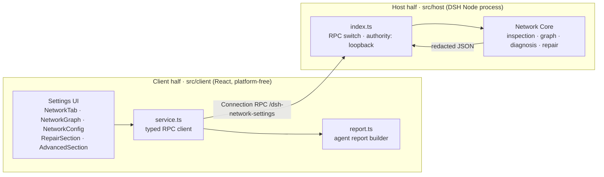
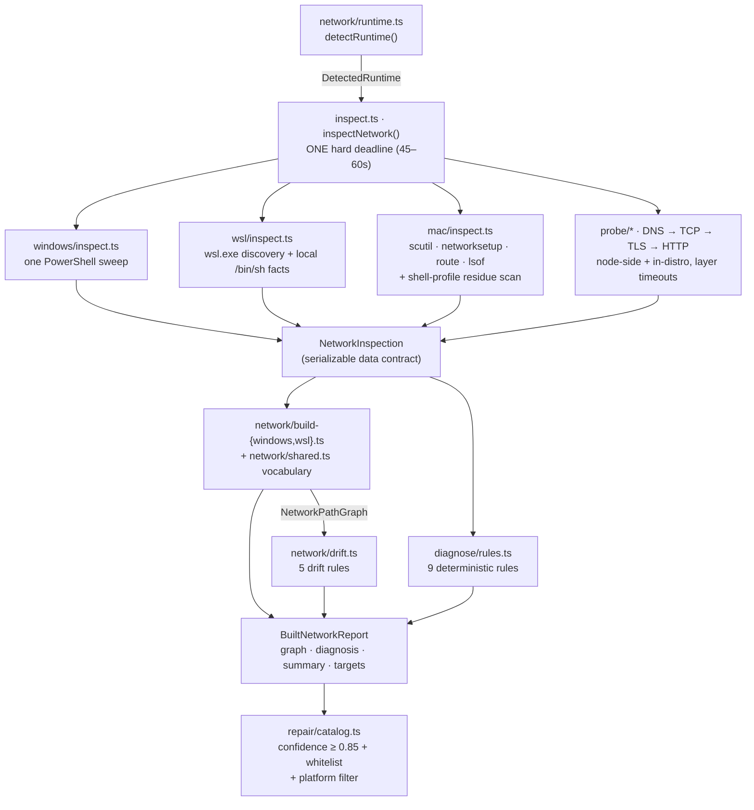
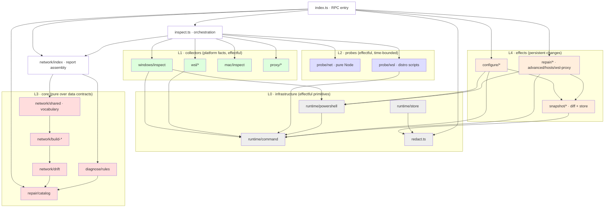
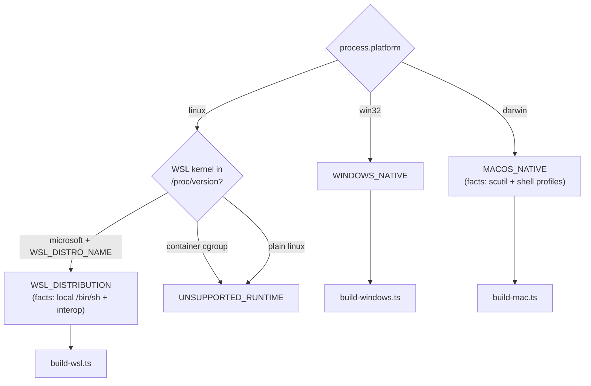
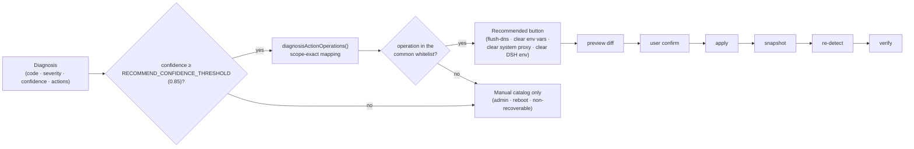
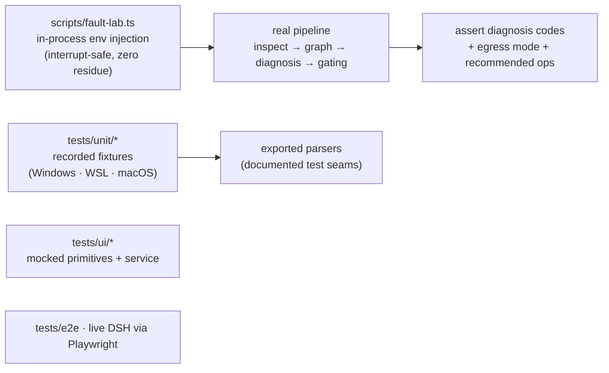

# Architecture

## Architecture diagrams

### 1. System layers — two halves, one RPC channel



The client never executes platform commands; every system action crosses the
RPC boundary. The wire contract mirrors `src/host/network/types.ts` on the
client as `src/client/contract.ts`.

### 2. Detection pipeline — data contracts on every edge



### 3. Module dependency layers (host half)



Rules of the layering: L3 is pure (no spawn, no fs) and unit-tested with
recorded fixtures; L1/L2 wrap every platform command behind one facade
function; L4 is the only place that mutates the system and always goes
through snapshots.

### 4. Runtime model selection



### 5. Repair recommendation gating and lifecycle



### 6. Testing seams



## Overview

```text
DSH Settings (React)
        │ typed RPC (/dsh-network-settings)
        ▼
Host half (DSH Node process)
        │
        ├─ Runtime detection: WINDOWS_NATIVE / WSL_DISTRIBUTION / UNSUPPORTED
        ├─ Windows/WSL static inspection
        ├─ Layered probes: DNS → TCP → TLS → HTTP
        ├─ NetworkPathGraph builder (DSH-only path)
        ├─ Configuration Drift rules
        ├─ Legacy deterministic diagnosis rules
        └─ Scoped repair / snapshot / rollback
```

The client never executes platform commands. Every system action goes through
the host RPC channel with `authority: loopback`.

## Modules

### `src/host/network`

| File | Responsibility |
|---|---|
| `types.ts` | JSON-safe graph types: `NetworkPathGraph`, `NetworkPath`, `PathNode`, `PathEdge`, `Evidence`, `ProxyConfiguration`, `ProxyEndpoint`, `NetworkDiagnostic`, `NetworkPathSummary` |
| `runtime.ts` | Static runtime detection from `process.platform`, `/proc/version`, `WSL_DISTRO_NAME`, `/etc/os-release`, cgroup |
| `survey.ts` | Read-only survey consumed by builders |
| `build-windows.ts` | `WINDOWS_NATIVE` DSH path builder |
| `build-wsl.ts` | `WSL_DISTRIBUTION` DSH path builder |
| `drift.ts` | Configuration Drift diagnostics + repair hints |
| `index.ts` | Orchestration: target list, graph building, summaries |

### `src/host`

| File/Area | Responsibility |
|---|---|
| `windows/inspect.ts` | PowerShell inspection: adapters, routes, WinINet, WinHTTP, env, listeners, Hosts, gateway ICMP/neighbor |
| `mac/inspect.ts` | macOS facts: scutil proxy, networksetup adapters, route, lsof listeners, shell-profile residue scan |
| `wsl/*` | `wsl.exe` list parsing, `.wslconfig`, `/etc/wsl.conf`, distribution facts |
| `probe/net.ts` | DNS/TCP/TLS/HTTP probes, repeated sampling for stability mode |
| `probe/probe.ts` | DIRECT/PROXY orchestration and first-failure layer mapping |
| `probe/wsl.ts` | In-distribution probes over `runWslScript` (local `/bin/sh` for the current distro, `wsl.exe` for others) |
| `network/shared.ts` | Shared graph helpers: proxy resolution, endpoint/listener matching, adapter selection (egress + physical uplink), gateway evidence |
| `diagnose/rules.ts` | Deterministic diagnosis rules |
| `configure/*` | Scoped configuration with preview/snapshot/apply |
| `repair/*` | Operation catalog, recommendations, WSL/Hosts repairs, advanced actions |
| `redact.ts` | Secret redaction for reports and snapshots |

### `src/client`

| File | Responsibility |
|---|---|
| `NetworkTab.tsx` | Settings tab entry, actions, target switcher, report copy |
| `NetworkGraph.tsx` | Diagnosis summary, first-failure details, DSH path lane |
| `NetworkConfig.tsx` | Hierarchical configuration with progressive disclosure |
| `RepairSection.tsx` | Recommended repairs + manual operations + rollback/history |
| `AdvancedSection.tsx` | High-risk system recovery actions with explicit confirmation |
| `service.ts` | Typed RPC client over the DSH Connection channel |
| `contract.ts` | Client-side wire types |

## Three runtime models

```text
WINDOWS_NATIVE
  DSH → Windows → [Proxy] → Adapter (TUN/VPN or physical) → [Physical uplink]
       → Gateway → Internet → Target

WSL_DISTRIBUTION
  DSH → Distribution → WSL Network (NAT/Mirrored/…) → Windows Host
       → [Proxy] → Adapter (TUN/VPN or physical) → [Physical uplink]
       → Gateway → Internet → Target

MACOS_NATIVE
  DSH → macOS → [Proxy] → Adapter (en0/utun) → Gateway → Internet → Target
```

Distribution identity and WSL network layer are separate concepts. NAT is an
edge translation semantic, never drawn as a fake server. Mirrored/Bridged/
VirtioProxy keep their own edge relations.

When a TUN/VPN adapter owns the default route (e.g. a proxy client's
`198.18.0.0/15` virtual network), it stays the egress adapter — traffic really
flows through it — but the graph also chains the physical uplink NIC and the
physical gateway behind it, and the Windows host node shows the physical IP.
ICMP/neighbor gateway evidence is only claimed for the gateway it was actually
measured against.

### Command execution per model

- `WINDOWS_NATIVE`: Windows facts via one PowerShell invocation; WSL facts via
  `wsl.exe`.
- `WSL_DISTRIBUTION`: the current distribution's probes and facts run through
  local `/bin/sh` (no interop round-trip, no re-entry hang); other
  distributions via `cmd.exe → wsl.exe`. Windows-side operations (WinINet,
  WinHTTP, env vars, DNS cache) still require Windows interop; when interop is
  unavailable they fail with an actionable message instead of raw ENOENT, and
  the current distribution is synthesized from local files so the graph keeps
  working.

## Probe layers

```text
DNS
  ↓ success
TCP (3 attempts in stability mode)
  ↓ success
TLS
  ↓ success
HTTP HEAD
```

Proxy paths delegate DNS to the proxy and use CONNECT for HTTPS targets.

Timeouts are enforced at every level: each layer carries its own budget
(DNS 4s, TCP 4s, TLS 6s, HTTP 8s — covering both response headers and body),
canceled probes resolve instead of hanging (DNS uses a cancellable Resolver),
and the whole inspection runs under one hard deadline (60s from the RPC entry,
45s by default) so a broken network can never stall a check indefinitely.

## Configuration Drift

A difference is not an error. Drift becomes a diagnostic only when:

- the DSH proxy endpoint is demonstrably gone/unreachable;
- WSL can reach Windows Host but not the configured proxy;
- WinHTTP still points at a port with no listener.

Healthy configuration differences are reported as `info`.

## Repair recommendation policy

A repair button is marked "recommended" only when both hold:

- the driving diagnosis has confidence ≥ 0.85 (`RECOMMEND_CONFIDENCE_THRESHOLD`),
- the mapped operation is in the common-operation whitelist
  (`flush-dns`, `clear-user-env-proxy`, `clear-wininet-user-proxy`,
  `clear-winhttp-user-proxy`, `clear-dsh-process-proxy`).

Admin/UAC, reboot-requiring and non-recoverable operations (machine env,
WinHTTP machine reset, Winsock/TCP-IP resets, `wsl-autoproxy-enable`) never
appear as recommendations; they stay in the manual catalog. Duplicate
operations across diagnoses are deduplicated server-side.

## Repair guarantees

Every persistent change:

```text
read current value → snapshot → diff preview → user confirmation
→ apply → re-detect → verify
```

A successful command is never treated as a successful network repair.
