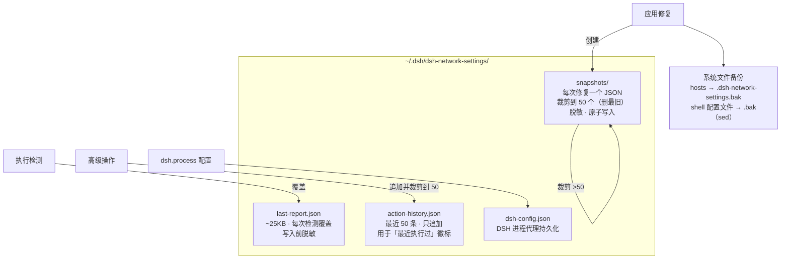
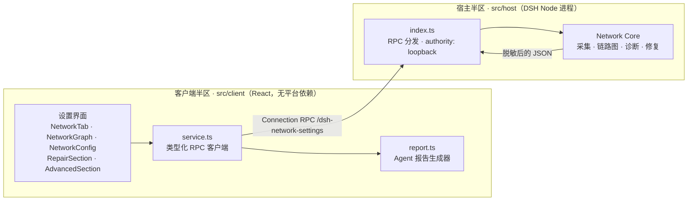
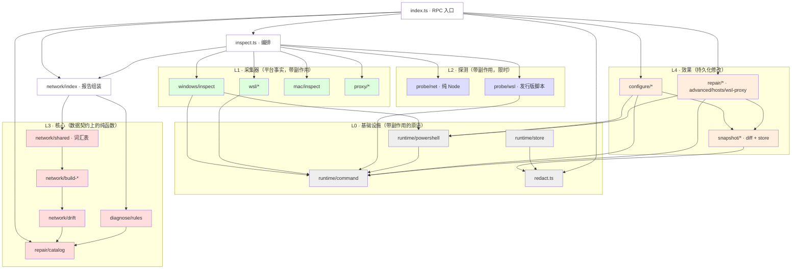
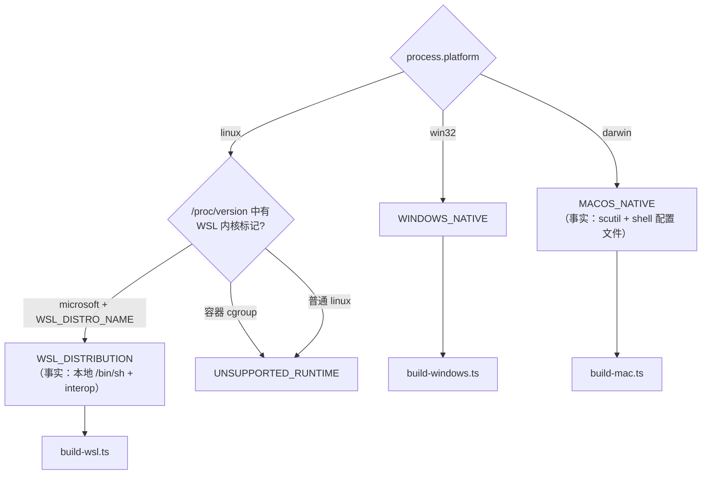
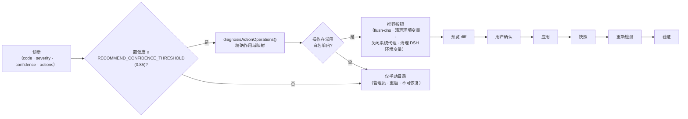
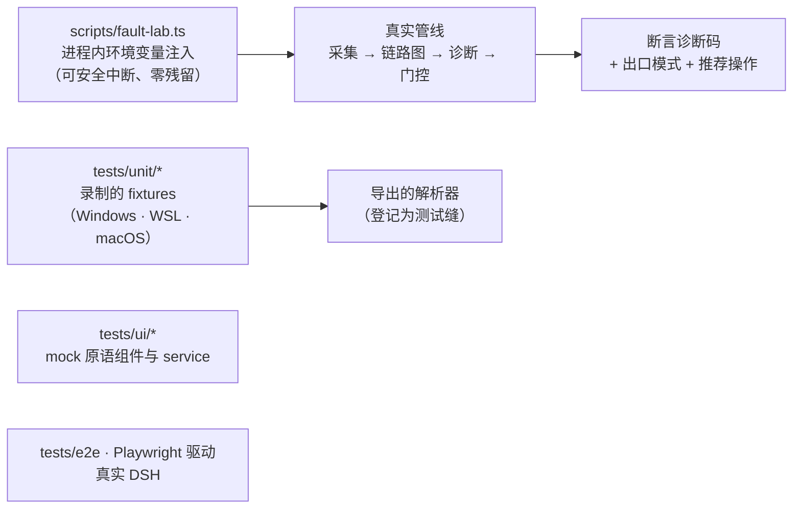

# 架构

<p align="center">
  <a href="architecture.md">简体中文</a> | <a href="architecture.en.md">English</a>
</p>

## 架构图

### 0. 文件存储层 —— 插件写什么、留多久



保留策略：`last-report.json` 单槽（永远是最新一份）；操作历史上限 50 条；
快照每次保存后裁剪到 50 个；系统文件备份（`.bak`）放在原文件旁边，由用户
自行清理。

### 1. 系统分层 —— 两个半区，一条 RPC 通道



客户端从不执行平台命令；所有系统操作都跨越 RPC 边界。线上契约以
`src/host/network/types.ts` 为权威定义，在客户端镜像为
`src/client/contract.ts`。

### 2. 检测管线 —— 每条边都是数据契约


### 3. 模块依赖分层（宿主半区）



分层规则：L3 是纯的（无 spawn、无 fs），用录制的 fixtures 做单元测试；
L1/L2 把每条平台命令收在一个门面函数后面；L4 是唯一修改系统的地方，
且总是经过快照。

**Deep Module 标注** —— 接口窄、隐藏了大量复杂度的模块（Ousterhout）：

| 模块 | 接口 | 隐藏的复杂度 |
|---|---|---|
| `runtime/command.ts` | `runCommand(file, args, opts)` | 超时、中止、SIGKILL 升级、输出上限、编码 |
| `windows/inspect.ts` | `inspectWindowsFacts()` | 一段 PowerShell 脚本、UTF-8 契约、netsh 解析 |
| `probe/probe.ts` | `probeTarget(target, path, opts)` | 四层递进、CONNECT 隧道、代理 DNS 旁路、采样 |
| `mac/inspect.ts` | `inspectMacFacts()` | scutil、networksetup、route、lsof、sw_vers、shell 配置文件扫描 |
| `inspect.ts` | `inspectNetwork()` | 硬性总时限、按模型驱动采集、端点合并、监听进程标注 |

有意**不做深模块**的部分（薄的数据变换器）：`network/shared.ts`（词汇表，
不是逻辑）、`redact.ts`（纯函数）、`snapshot/diff.ts`（JSON diff）。

### 4. 运行时模型选择



### 5. 修复推荐门控与生命周期



### 6. 测试缝



## 总览

```text
DSH 设置界面（React） ←── 无平台依赖，不执行系统命令
        │ 类型化 RPC（/dsh-network-settings，authority: loopback）
        ▼
宿主半区（DSH Node 进程）
        │
        ├─ 运行时检测：WINDOWS_NATIVE / WSL_DISTRIBUTION / MACOS_NATIVE
        ├─ 平台采集器（L1）：windows/wsl/mac —— 各一个门面
        ├─ 分层探测（L2）：DNS → TCP → TLS → HTTP，硬性超时
        ├─ 纯核心（L3）：链路图构建 + 诊断规则 + 修复目录
        ├─ 效果层（L4）：configure + repair + snapshot —— 唯一的修改层
        └─ 文件存储：last-report（单槽）+ snapshots（裁剪到 50 个）
```

客户端从不执行平台命令。所有系统操作都通过宿主的 RPC 通道完成，
`authority: loopback`。

## 模块

### `src/host/network`

| 文件 | 职责 |
|---|---|
| `types.ts` | JSON 安全的链路图类型：`NetworkPathGraph`、`NetworkPath`、`PathNode`、`PathEdge`、`Evidence`、`ProxyConfiguration`、`ProxyEndpoint`、`NetworkDiagnostic`、`NetworkPathSummary` |
| `runtime.ts` | 基于 `process.platform`、`/proc/version`、`WSL_DISTRO_NAME`、`/etc/os-release`、cgroup 的静态运行时检测 |
| `survey.ts` | 供构建器消费的只读勘察 |
| `build-windows.ts` | `WINDOWS_NATIVE` 的 DSH 链路构建器 |
| `build-wsl.ts` | `WSL_DISTRIBUTION` 的 DSH 链路构建器 |
| `build-mac.ts` | `MACOS_NATIVE` 的 DSH 链路构建器（直连 + 代理） |
| `drift.ts` | 配置漂移诊断 + 修复提示 |
| `index.ts` | 编排：目标列表、链路图构建、摘要 |

### `src/host`

| 文件/区域 | 职责 |
|---|---|
| `windows/inspect.ts` | PowerShell 采集：网卡、路由、WinINet、WinHTTP、环境变量、监听端口、Hosts、网关 ICMP/邻居发现 |
| `mac/inspect.ts` | macOS 事实：scutil 代理、networksetup 网卡、route、lsof 监听、shell 配置文件残留扫描 |
| `wsl/*` | `wsl.exe` 列表解析、`.wslconfig`、`/etc/wsl.conf`、发行版事实 |
| `probe/net.ts` | DNS/TCP/TLS/HTTP 探测，稳定性模式的重复采样 |
| `probe/probe.ts` | DIRECT/PROXY 编排与首层失败映射 |
| `probe/wsl.ts` | 基于 `runWslScript` 的发行版内探测（当前发行版走本地 `/bin/sh`，其它发行版走 `wsl.exe`） |
| `network/shared.ts` | 共享链路图工具：代理解析、端点/监听匹配、网卡选择（出口 + 物理上联）、网关证据 |
| `diagnose/rules.ts` | 确定性诊断规则 |
| `configure/*` | 带预览/快照/应用的作用域配置 |
| `repair/*` | 操作目录、推荐、WSL/Hosts 修复、高级操作 |
| `redact.ts` | 报告与快照的密钥脱敏 |

### `src/client`

| 文件 | 职责 |
|---|---|
| `NetworkTab.tsx` | 设置页签入口、操作、目标切换、报告复制 |
| `NetworkGraph.tsx` | 诊断摘要、首层失败详情、DSH 链路泳道 |
| `NetworkConfig.tsx` | 渐进披露的分层配置面板 |
| `RepairSection.tsx` | 推荐修复 + 手动操作 + 回滚/历史 |
| `AdvancedSection.tsx` | 高风险系统急救操作（显式确认） |
| `service.ts` | 基于 DSH Connection 通道的类型化 RPC 客户端 |
| `contract.ts` | 客户端线上类型 |

## 三种运行时模型

```text
WINDOWS_NATIVE
  DSH → Windows → [代理] → 网卡（TUN/VPN 或物理） → [物理上联]
       → 网关 → 互联网 → 目标

WSL_DISTRIBUTION
  DSH → 发行版 → WSL 网络（NAT/Mirrored/…） → Windows 宿主
       → [代理] → 网卡（TUN/VPN 或物理） → [物理上联]
       → 网关 → 互联网 → 目标

MACOS_NATIVE
  DSH → macOS → [代理] → 网卡（en0/utun） → 网关 → 互联网 → 目标
```

发行版身份与 WSL 网络层是两个独立概念。NAT 是一种边缘翻译语义，绝不画成
假的服务器节点。Mirrored/Bridged/VirtioProxy 各自保持自己的边关系。

当 TUN/VPN 网卡持有默认路由时（例如代理客户端的 `198.18.0.0/15` 虚拟网段），
它仍是出口网卡——流量确实经过它——但链路图还会在其后串出物理上联网卡与
物理网关，Windows 宿主节点显示物理 IP。ICMP/邻居发现的网关证据只对实际
测量过的网关成立。

### 各模型的命令执行方式

- `WINDOWS_NATIVE`：Windows 事实一次 PowerShell 调用完成；WSL 事实经
  `wsl.exe`。
- `WSL_DISTRIBUTION`：当前发行版的探测与事实走本地 `/bin/sh`（无 interop
  往返，不会重入挂起）；其它发行版经 `cmd.exe → wsl.exe`。Windows 侧操作
  （WinINet、WinHTTP、环境变量、DNS 缓存）仍需 Windows interop；interop
  不可用时给出可操作的错误信息而不是裸 ENOENT，当前发行版由本地文件合成，
  链路图照常工作。

## 探测分层

```text
DNS
  ↓ 成功
TCP（稳定性模式 3 次尝试）
  ↓ 成功
TLS
  ↓ 成功
HTTP HEAD
```

代理路径把 DNS 委托给代理解析，HTTPS 目标使用 CONNECT 隧道。

超时在每一层都强制生效：每层有独立预算（DNS 4s、TCP 4s、TLS 6s、HTTP 8s
——覆盖响应头和响应体），被取消的探测立即返回而不是挂起（DNS 使用可取消
的 Resolver），整次采集运行在一个硬性总时限内（RPC 入口起 60s，默认 45s），
网络故障永远不会让检测无限停摆。

## 配置漂移

配置不同不等于错误。只有满足以下条件，漂移才升级为诊断：

- DSH 的代理端点已被证实消失/不可达；
- WSL 能到达 Windows 宿主，却到不了配置的代理；
- WinHTTP 仍指向一个没有监听的端口。

健康的配置差异报告为 `info`。

## 修复推荐策略

一个修复按钮被标为「推荐」必须同时满足三条：

- 驱动它的诊断置信度 ≥ 0.85（`RECOMMEND_CONFIDENCE_THRESHOLD`）；
- 映射到的操作在常用操作白名单内；
- 操作的平台标签匹配当前运行时（`operationsForPlatform(process.platform)`
  过滤目录与推荐——Windows 专属操作在 macOS 上不可见，反之亦然）。

白名单包含平台中立操作（`clear-dsh-process-proxy`、`flush-dns`/
`mac-flush-dns`），以及只在各自平台被推荐的平台专属操作（Windows 的
`clear-user-env-proxy`，macOS 的 `mac-clear-shell-proxy`/
`mac-clear-scutil-proxy`）。

管理员/UAC、需要重启、不可恢复的操作（机器级环境变量、WinHTTP 机器级
重置、Winsock/TCP-IP 重置、`wsl-autoproxy-enable`）绝不作为推荐出现；
它们只保留在手动目录中。多个诊断产生的重复操作在服务端去重。

## 修复保证

每次持久化修改都遵循：

```text
读取当前值 → 快照 → diff 预览 → 用户确认
→ 应用 → 重新检测 → 验证
```

命令执行成功永远不等于网络修复成功。

### 文件保留策略

| 文件 | 策略 | 上限 |
|---|---|---|
| `last-report.json` | 每次检测覆盖 | 1 个文件（约 25KB） |
| `action-history.json` | 追加，删最旧 | 50 条 |
| `snapshots/*.json` | 每次修复一个，保存后裁剪 | 50 个文件 |
| 系统 `.bak` 文件 | 放在原文件旁 | 用户自管 |

所有文件写入前脱敏；快照使用原子写入（tmp + rename）。
